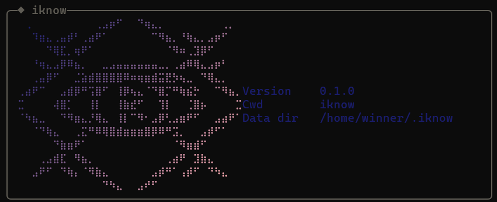

# iknow

A local coding agent for tool-calling LLMs, with a shared runtime for the CLI, terminal UI, and web interface. It can work in a selected workspace, run sandboxed shell commands, use tools such as LSP and MCP, and verify work with tests and evidence.



**Status:** Alpha. Features and workflows are still evolving.

## Features

- **LSP client:** symbol navigation and editing, hover, diagnostics, and call hierarchy where supported by the language server. Built-in routing covers TypeScript/JavaScript, Python, YAML, JSON, and Dockerfile.
- Workspace file tools and code search, plus permission-checked shell commands in a bubblewrap sandbox.
- A tool-calling agent loop with context compression and a verification workflow.
- MCP server tools and resources over stdio.
- Bounded-concurrency subagents with result collection and stop/continue controls.
- Checkpointed sessions that can resume or rewind, with optional workspace-file restoration.
- File-backed memory with BM25 keyword retrieval, plus on-demand skills.
- CLI, multi-session TUI, and web interfaces share a runtime; JSONL traces make agent runs inspectable.

## Requirements

- Node.js 24 is recommended, with npm. The current development dependencies require Node.js 22.22.1 or newer.
- [Bun](https://bun.sh) to run the TUI.
- [bubblewrap](https://github.com/containers/bubblewrap) 0.11.1 or newer for sandboxed shell commands.
- The TUI is verified on Linux and WSL2; other platforms have not been verified.

## Quick start

```bash
git clone https://github.com/winter6205/iknow.git
cd iknow
npm ci
npm run build
```

Before the first run, configure your model and API key, and set a custom endpoint if needed. See the [LLM configuration guide](docs/llm-config-quickstart.md).

Start the TUI:

```bash
npm run dev:tui
```

To start the interactive CLI instead:

```bash
npx tsx src/cli.ts chat
```

To build and run the web interface:

```bash
npm run web:build
node dist/cli.js serve
```

## Development

```bash
npm run typecheck
npm test
```

## Documentation

- [Project status](docs/STATUS.md)
- [Architecture](docs/architecture.md)
- [LLM configuration](docs/llm-config-quickstart.md)
- [Active specs](specs/README.md)
- [Changelog](CHANGELOG.md)

## Acknowledgments

Design references are listed in [ATTRIBUTION.md](ATTRIBUTION.md).

## License

MIT — see [LICENSE](LICENSE).
