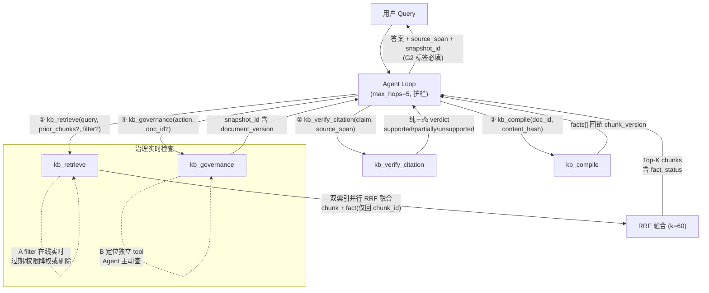
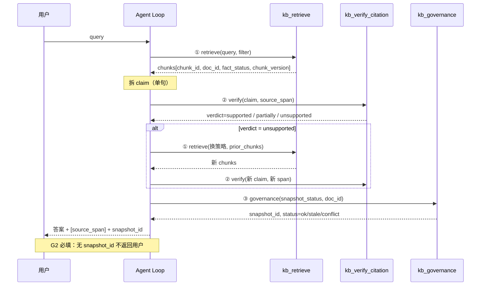
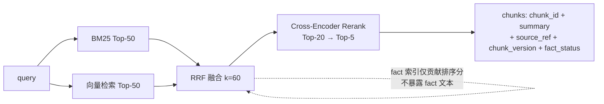
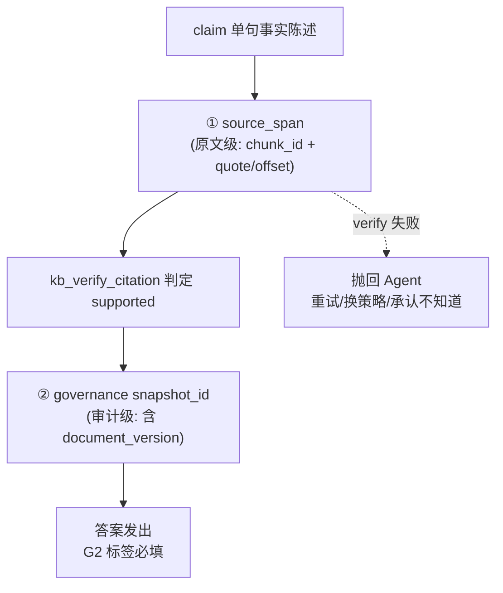

# iknow 架构图与数据流（协议层 v0.1）

> 阶段：Phase 1 协议层。本文只描述 **tool 编排关系与数据流**，不画 gbrain 内部类结构（Phase 3 实现层）。
> 对齐：ADR-v0.1-iknow.md §2（4 tool 协议）、§3（6 原则）。

---

## 一、系统架构图



**读图要点**：

- Agent Loop 是中枢，4 tool 都是它调用的叶子节点，无 tool 间直接调用（除 `kb_compile` 产出供 `kb_retrieve` 索引使用，属后台数据流，非 loop 内调用）。
- 治理有两路：检索前 `kb_retrieve` 的 A filter 在线实时检查（不占 tool 名额）+ Agent 主动调 `kb_governance`（B 定位）。
- 溯源三层在 loop 出口闭合：claim → source_span（verify）→ snapshot_id（governance）。

---

## 二、单次问答数据流（时序）



---

## 三、双索引检索内部流（kb_retrieve 封装）



**原则落地**：fact 索引只回 `chunk_id` 供排序，绝不将 fact 文本注入 Agent 上下文或 verify 输出层（ADR 原则 1）。

---

## 四、溯源三层闭环（审计视角）



---

## 五、多跳场景（hops 护栏示意）

```mermaid
flowchart TD
    Q[跨文档问题] --> H1["hop1: retrieve(维度A)"]
    H1 --> D1[chunks_A]
    D1 --> H2["hop2: retrieve(维度B, prior_chunks=[A摘要])"]
    H2 --> D2[chunks_B]
    D2 --> MERGE["Agent 合并两维度<br/>各自溯源"]
    MERGE --> OUT[答案 + [span_A][span_B] + [snap_A][snap_B]]
    H2 -. "hops>5" .-> STOP["强制返回<br/>'无法确认' + 已检索来源"]
```

**护栏口径**（ADR §4）：hops 只计 Agent 主动 retrieve/verify 探索步；governance 注入、补编后自动重检索属基础设施动作，不计入。超 `max_hops=5` 强制"无法确认"。

---

## 六、图与 ADR 的对应关系

| 图               | 对应 ADR                       |
| ---------------- | ------------------------------ |
| 一、系统架构图   | §2 四 tool + §3 原则 2/3       |
| 二、单次问答时序 | §2.1–2.4 调用顺序 + 原则 4(G2) |
| 三、双索引内部流 | §2.1 双索引 RRF + 原则 1       |
| 四、溯源三层     | §3 原则 2                      |
| 五、多跳护栏     | §3 原则 5                      |

> 本文为协议层心智模型，gbrain 内部实现（类结构、索引存储、SDK 接入）属 Phase 3，不在本图范围。
