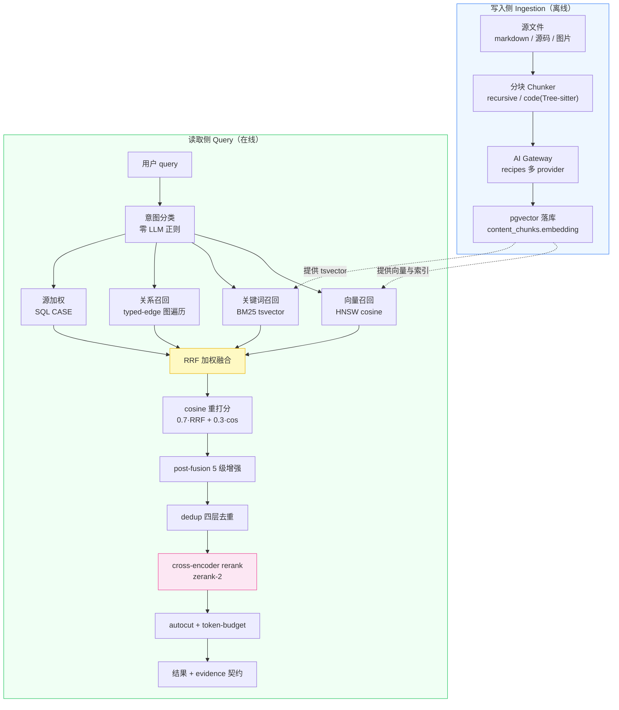
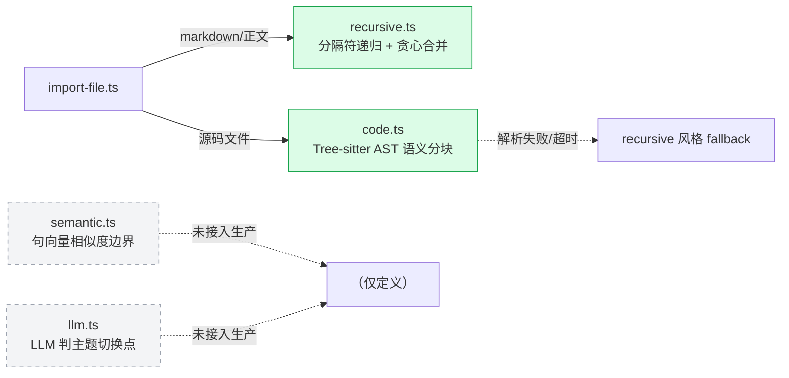
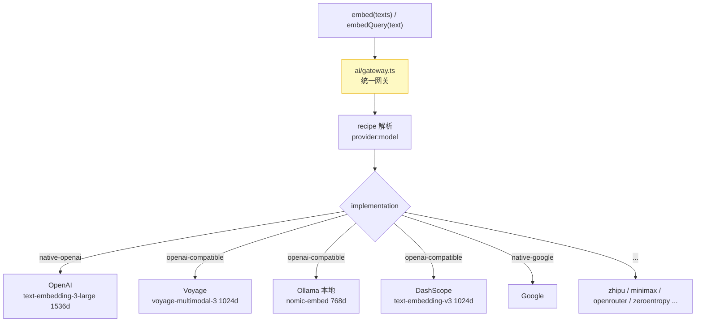
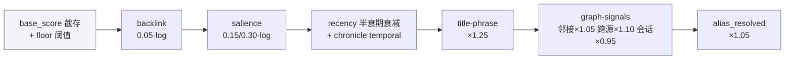
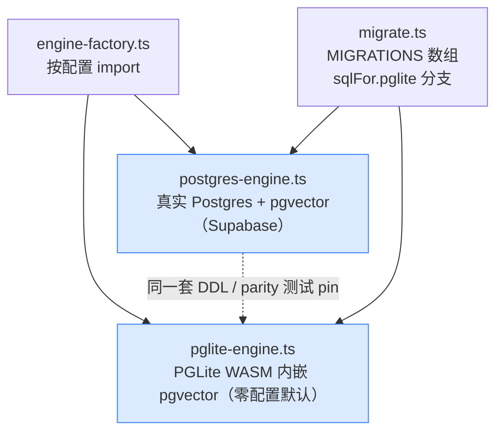
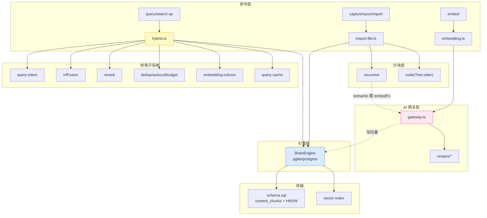

# GBrain 向量检索技术栈全景（可视化）

> **分析对象**：`_upstream_gbrain/`（garrytan/gbrain，本地快照 v0.42.57.0，commit `058f448`）
> **目的**：为 iknow 对向量检索部分的二次开发，提供一份可对照源码的完整技术栈地图。
> **方法**：codebase-memory 图谱索引 + 4 路并行子代理源码深挖 + 主管线 `hybrid.ts` 逐段交叉验证。
> **姊妹文档**：全局架构与 LLM 接入见 `docs/20260714-2-gbrain-secondary-dev-guide.md`；本文专注**检索子系统**。
> **真值原则**：凡官方 `docs/architecture/RETRIEVAL.md` 与源码冲突处，**一律以 `src/core/search/hybrid.ts` 源码为准**（官方流程图的阶段顺序已过时，见 §10 陷阱清单）。

---

## 0. TL;DR — 一张图看懂

GBrain 的检索不是"向量搜索"，而是**四路召回 + 多级重排的混合栈**。核心理念（官方 RETRIEVAL.md）：单一策略都会失败，四层叠加才互补。



**四个关键数字**（均已源码核实）：

| 项                  | 值                            | 出处                      |
| ------------------- | ----------------------------- | ------------------------- |
| RRF 常数 k          | `60`                          | `hybrid.ts:47` `RRF_K`    |
| cosine 重打分混合比 | `0.7·normRRF + 0.3·cosine`    | `hybrid.ts:1986`          |
| compiled_truth 提升 | `×2.0`（归一化后）            | `hybrid.ts:48`            |
| 向量距离算子        | 仅 cosine `<=>`（无 L2/内积） | `postgres-engine.ts:1933` |

---

## 1. 写入侧：文本 → 向量

### 1.1 分块（Chunking）策略

生产主链路**只有两条**，并非"可配置 chunker 框架"：



| Chunker       | 算法                                                                              | 默认参数                                               | 生产状态                             |
| ------------- | --------------------------------------------------------------------------------- | ------------------------------------------------------ | ------------------------------------ |
| **recursive** | 分隔符优先级（段落→行→句→从句→词→字符）递归切分 + 贪心合并 + 重叠 + 6000 字符硬顶 | `chunkSize=300 词` / `overlap=50 词` / `maxChars=6000` | ✅ 文本默认（`import-file.ts:628`）  |
| **code**      | Tree-sitter AST，以函数/类/方法为自然块，同次解析抽取调用边                       | `300 tokens` / 大节点阈值 `1000` / 解析超时 `30s`      | ✅ 源码默认（`import-file.ts:1097`） |
| semantic      | 句向量 cosine + Savitzky-Golay 一阶导找边界（bottom 20%）                         | 边界最小间距 2 句                                      | ⚠️ 仅定义，未接入                    |
| llm           | LLM 在 128 词候选窗口中判主题切换点                                               | window=5 / 重试 3                                      | ⚠️ 仅定义，未接入                    |

**两个工程细节**：

- `recursive` 写入前做**隐私预处理**：剥离 takes fence、仅保留 `world` 可见 facts（`recursive.ts:58-88`）。
- `compiled_truth` 与 `timeline` **分别独立分块**并打 `chunk_source` 标记——这是读取侧 `×2.0` boost 的数据基础。
- 分块带**版本号**（`MARKDOWN_CHUNKER_VERSION=3` / `CHUNKER_VERSION=4`），写入 page，用于升级后触发重分块/重嵌。

### 1.2 Embedding Provider 抽象（Gateway + Recipes）

这是接 LLM/embedding 的**唯一正确入口**，纯数据配方 + 静态工厂：



- **recipes 是纯数据**（`ai/recipes/*.ts`）：声明 base URL、key 环境变量名、模型、默认/可选维度、batch token 上限、chars/token、safety factor、是否 multimodal。
- **非对称编码**：ingestion 用 `embed()`（`document` 编码），查询用 `embedQuery()`（`query` 编码）——Voyage/ZeroEntropy 等非对称模型靠此区分。
- **维度协商**优先级：`opts.dimensions → config.embedding_dimensions → DEFAULT`（当前通用默认 1536）。provider 返回后**逐向量校验长度**，不符即抛配置错误（`gateway.ts:1582`）。
- **不做统一 L2 归一化**：gateway 仅 `new Float32Array(e)`，是否单位化取决于 provider；cosine 算子本身按范数计算，故不依赖归一化不变量。
- **两层 batch**：外层 `embedBatch` 每 100 条（进度粒度）；内层 gateway 按 provider token 预算 `splitByTokenBudget`（每条先截 8000 字符）。provider 报 batch 超限则**对半递归 + safety_factor×0.5**，连续成功 10 批后 ×1.5 恢复。

### 1.3 落库与多向量列

主表 `content_chunks` 支持**多向量空间并存**（不同空间，不可交叉比较）：

| 列                     | 类型           | 维度 | 默认模型               | 用途                     |
| ---------------------- | -------------- | ---- | ---------------------- | ------------------------ |
| `embedding`            | `vector(1536)` | 1536 | text-embedding-3-large | 主文本空间               |
| `embedding_image`      | `vector(1024)` | 1024 | voyage-multimodal-3    | 图片空间（partial HNSW） |
| `embedding_multimodal` | `vector(1024)` | 1024 | voyage multimodal-3    | 统一 cross-modal 空间    |

另有 `takes.embedding`(1536)、`facts.embedding`（按 pgvector 版本动态选 `halfvec`/`vector`）。

**写入顺序**（markdown）：`chunkText → 可选 contextual-retrieval title 包装（仅包 embedding 输入，不改 canonical chunk_text）→ embedBatch → 事务内 putPage + upsertChunks + setPageEmbeddingSignature`。
**源码增量**：按 chunk hash 比对旧块，**未变化块复用旧向量**，仅对新增/变化块调 embedding。

### 1.4 Backfill 与 CLI 入口

- 通用 runner `backfill-base.ts`：keyset 分页 + config 表 checkpoint + 固定连接事务 + 自适应 batch（1000→16）+ 600s/batch 超时。
- ⚠️ `backfill-registry` 里的 `embedding_voyage` 是 **declared-only no-op**（`needsBackfill: '1 = 0'`）。**真正补主文本向量用 `gbrain embed --stale`**，不是 backfill。
- 入口：`gbrain capture`（人类统一入口）/ `sync`（仓库批量，可 deferred 后由 embed-backfill job 补）/ `import`（单文件）/ `embed`（显式生成/回填）。

---

## 2. 读取侧：18 阶段主管线

> 以 `hybridSearch`（`hybrid.ts:809`）源码为准。官方 RETRIEVAL.md 的"graph→rerank→budget→dedup"顺序**已过时**。

```mermaid
flowchart TB
    START(["hybridSearch(query, opts)"]) --> M1["1 模式解析<br/>resolveSearchMode"]
    M1 --> M2["2 嵌入列解析<br/>resolveEmbeddingColumn"]
    M2 --> M3["3 意图分类（零LLM）<br/>classifyQuery + weightsForIntent"]
    M3 --> M4{"modality 模糊<br/>且 llm_intent 开?"}
    M4 -->|是| M5["LLM 模态裁决<br/>Haiku 1s 超时 fail-open"]
    M4 -->|否| KW
    M5 --> KW["4 关键词召回<br/>searchKeyword"]
    KW --> EXP{"expansion 开?"}
    EXP -->|是| EXPQ["LLM 多查询扩展<br/>2-3 变体"]
    EXP -->|否| VEC
    EXPQ --> VEC["5 向量召回<br/>searchVector(HNSW)"]
    VEC --> REL{"relational 开?"}
    REL -->|是| RELARM["关系召回臂<br/>typed-edge 图"]
    REL -->|否| FUSE
    RELARM --> FUSE["6 RRF 加权融合<br/>rrfFusionWeighted"]
    FUSE --> COS["7 cosine 重打分<br/>0.7·RRF+0.3·cos"]
    COS --> POST["8 post-fusion 5 级<br/>backlink/salience/recency/title/graph/alias"]
    POST --> EXACT["9 exact-match boost"]
    EXACT --> TP{"walkDepth>0<br/>或 nearSymbol?"}
    TP -->|是| TWO["two-pass 结构扩展<br/>邻居分=anchor/(1+hop)"]
    TP -->|否| DEDUP
    TWO --> DEDUP["10 dedup 四层"]
    DEDUP --> ESC{"detail=low<br/>且 0 命中?"}
    ESC -->|是| RECUR["递归升级 detail=high"]
    ESC -->|否| RERANK
    RECUR --> RERANK["11 cross-encoder rerank<br/>zerank-2"]
    RERANK --> ALIAS["12 alias hop<br/>名字锚点注入/×1.10"]
    ALIAS --> EV["13 evidence 契约戳"]
    EV --> ADAPT["14 adaptive return（可选）"]
    ADAPT --> CUT["15 autocut 评分断崖"]
    CUT --> SLICE["16 slice(offset,limit)"]
    SLICE --> BUDGET["17 token-budget 贪心截断"]
    BUDGET --> TEL["18 telemetry + content flags"]
    TEL --> END(["SearchResult[]"])

    style FUSE fill:#fef9c3,stroke:#eab308
    style COS fill:#fef9c3,stroke:#eab308
    style RERANK fill:#fce7f3,stroke:#ec4899
    style DEDUP fill:#ffedd5,stroke:#f97316
```



**缓存包装**：公开入口是 `hybridSearchCached`（`hybrid.ts:1569`）——最前做语义缓存 lookup，命中则跳过召回/融合/去重/rerank，仅重跑 slice + budget；未命中跑主线后异步 store。

### 2.1 四路召回

| 臂         | 实现                                             | 算子/机制                                                                       | top-k 策略                                |
| ---------- | ------------------------------------------------ | ------------------------------------------------------------------------------- | ----------------------------------------- |
| **向量**   | `engine.searchVector`                            | pgvector cosine `<=>`，HNSW 候选 CTE                                            | `innerLimit = offset + max(limit·5, 100)` |
| **关键词** | `engine.searchKeyword`                           | `search_vector @@ websearch_to_tsquery` 过滤 + `ts_rank` 打分（**无 trigram**） | `innerLimit = min(limit·3, MAX·3)`        |
| **关系**   | `buildRelationalArm` + `engine.relationalFanout` | 正则解析关系型 query（who_rel/who_at/connects/intro），走 typed-edge 图         | 仅 relational 查询触发，否则 no-op        |
| **源加权** | `sql-ranking.ts` SQL CASE                        | `CASE WHEN slug LIKE 'prefix%' THEN factor`（前缀按长度降序）                   | `detail='high'` 时禁用                    |

**向量召回两阶段 CTE**（`postgres-engine.ts:1927`）：

1. `hnsw_candidates`：裸距离 `ORDER BY col <=> vec` 让 HNSW 生效，`raw_score = 1 - distance`。
2. `best_per_page`：`DISTINCT ON (source_id, slug)` **按页取最优 chunk**（max-pool，复合键防跨源误并），再 `LIMIT`。

### 2.2 RRF 加权融合（`hybrid.ts:1860`）

```
score(chunk) = Σ 1/(k_i + rank_i)      # 每路独立 k_i = RRF_K / weight_i
normalized   = raw / max(raw)          # 归一化到 [0,1]
boosted      = normalized × (2.0 if compiled_truth else 1.0)
```

- 融合键含 `source_id`：`{source_id}:{slug}:{chunk_id}`——联邦多源下同名 slug 不合并。
- intent 权重调每路 k：权重 >1 → k 降低 → 该路 top 排名更陡。

**Intent 权重表**（`intent-weights.ts`）：

| Intent   | keywordW | vectorW | recency | exactMatchBoost |
| -------- | -------- | ------- | ------- | --------------- |
| entity   | 1.15     | 1.0     | —       | 1.25            |
| temporal | 1.0      | 1.0     | on      | 1.0             |
| event    | 1.20     | 0.95    | on      | 1.10            |
| general  | 1.0      | 1.0     | —       | 1.0             |

### 2.3 cosine 重打分（`hybrid.ts:1951`）

```
final = 0.7 · normRRF + 0.3 · cosine(query_emb, chunk_emb)
```

关键：**从 HNSW 实际使用的同一向量列** hydrate embedding 重算（`getEmbeddingsByChunkIds(col)`），避免 Voyage 检索却拿 OpenAI 向量重算导致 NaN/错排。

### 2.4 post-fusion 5 级增强（`runPostFusionStages`，`hybrid.ts:432`）

入口先**一次性**截存 `base_score` 并计算 floor 阈值（单一基线，所有级共享，防弱页越级）：



- **recency 半衰期表**（按 slug 前缀）：`component = coef·halflife/(halflife+daysOld)`，`factor = 1 + strength·component`。concepts 永青（0/0）、chat 7 天、daily 14 天、originals 180 天。
- 全部级 **fail-open**（单级异常不破坏整条管线）。

### 2.5 去重 / 重排 / 截断

- **dedup 四层**（`dedup.ts`）：每页按分保留 top3 → Jaccard>0.85 删重 → type 比例上限（0.6）→ 每页 maxPerPage(2)；末了 `guaranteeCompiledTruth` 保底每页有 compiled_truth。
- **rerank**（`rerank.ts`）：走 `gatewayRerank`（**非本地算法**，是 query+document cross-encoder）。默认 `zeroentropyai:zerank-2`；也支持本地 `llama-server-reranker`（`localhost:8081/v1/rerank`，默认 qwen3-reranker-4b，30s 超时，零成本，与 embeddings 服务互斥）。全错误 fail-open 原序返回。官方基准：reshuffle **60% 的 top-1**。
- **autocut**（`autocut.ts`）：基于 **rerank_score**（非 RRF/cosine）找最大归一化分差，`gap ≥ 0.2` 则断崖截断，`minKeep=1`，永不空。
- **token-budget**（`token-budget.ts`）：`tokens = ceil(len/4)`，自顶向下贪心，超预算即 break。
- **evidence 契约**（`evidence.ts`）：每条结果带 `evidence`（alias_hit/exact_title_match/high_vector_match/keyword_exact/weak_semantic）+ `create_safety`（exists/probable/unknown）——agent 判"是否已存在、可否不写重复"靠它，不靠裸分数。

---

## 3. 存储层与向量索引

### 3.1 双引擎（lockstep 演进）



- **PGLite 自带 pgvector**（WASM bundle 内嵌，不需宿主扩展），与 Postgres 共用同一套 DDL，仅剥离 RLS DO-block。
- ⚠️ **`src/core/storage/`（local/s3/supabase）是对象存储后端，不是数据库**。数据库引擎是 `pglite-engine.ts` / `postgres-engine.ts`。
- 两引擎由 `test/e2e/engine-parity.test.ts` 锁定同步。

### 3.2 向量索引（全部 HNSW + cosine）

| 索引                         | 表.列                          | opclass                             | 谓词                                                 |
| ---------------------------- | ------------------------------ | ----------------------------------- | ---------------------------------------------------- |
| `idx_chunks_embedding`       | content_chunks.embedding       | `vector_cosine_ops`                 | 全表                                                 |
| `idx_chunks_embedding_image` | content_chunks.embedding_image | `vector_cosine_ops`                 | `WHERE embedding_image IS NOT NULL`                  |
| `idx_takes_embedding_hnsw`   | takes.embedding                | `vector_cosine_ops`                 | `WHERE active AND embedding IS NOT NULL`             |
| `idx_facts_embedding_hnsw`   | facts.embedding                | `vector/halfvec_cosine_ops`（动态） | `WHERE embedding IS NOT NULL AND expired_at IS NULL` |

- **距离算子全用 cosine `<=>`，无 L2 `<->` / 内积 `<#>`**。
- `PGVECTOR_HNSW_VECTOR_MAX_DIMS=2000`：>2000 维**跳过 HNSW**，回退精确扫描。
- 索引生命周期管理（`vector-index.ts`）：zombie 清理、active build 探测、CONCURRENTLY 重建 + 原子 RENAME 切换。

### 3.3 embedding-column 抽象（中央 seam）

`embedding-column.ts`（582 行）是 v0.36+ 的**列路由单一真相**：

- **registry**：内置 `embedding`/`embedding_image` + 用户 `config.embedding_columns` 覆盖。
- **解析链**：`opts.embeddingColumn → config.search_embedding_column → 'embedding'`。
- **约束**：列名正则 `^[a-z_][a-z0-9_]*$`、dims 1–8192、type ∈ {vector, halfvec}、`quoteIdentifier` 防注入。
- **cache-safety**：仅当列名 `embedding` 且 dims/provider 与 config 完全一致才走语义缓存——**防 Voyage(1024) 与 OpenAI(1536) 跨空间污染**。
- ⚠️ 当前主要是**搜索侧路由抽象**；通用"写任意自定义列"的 write-path 仍是后续工作，`gbrain embed` 核心仍写主 `embedding` 列。

---

## 4. 打分公式全链路（一个 chunk 的分数演化）

```mermaid
flowchart LR
    A["HNSW raw_score<br/>= 1 - cosine_dist"] --> B["RRF 贡献<br/>1/(k+rank)"]
    B --> C["归一化 /max"]
    C --> D["×2.0 if compiled_truth"]
    D --> E["cosine 重打分<br/>0.7·RRF+0.3·cos"]
    E --> F["×backlink ×salience<br/>×recency ×title"]
    F --> G["×graph 1.05/1.10/0.95"]
    G --> H["×alias 1.05/1.10"]
    H --> I["rerank_score<br/>cross-encoder 重排"]
    I --> J["autocut 断崖裁剪"]
    J --> K["token-budget 截断"]

    style E fill:#fef9c3
    style I fill:#fce7f3
```



---

## 5. 搜索模式（三档 bundle）

解析链：`perCall → config 单键 → MODE_BUNDLES[mode] → balanced`（`mode.ts:571`，纯函数）。

| Knob                 | conservative           | balanced | tokenmax           |
| -------------------- | ---------------------- | -------- | ------------------ |
| tokenBudget          | 4000                   | 12000    | off                |
| expansion（LLM）     | off                    | off      | **on**             |
| relationalRetrieval  | off                    | **on**   | on                 |
| reranker             | off                    | **on**   | on                 |
| graph_signals        | off                    | on       | on                 |
| autocut              | off                    | on       | on                 |
| contextual_retrieval | none                   | title    | per_chunk_synopsis |
| searchLimit 默认     | 10                     | 25       | 50                 |
| cache（三档同）      | enabled / 0.92 / 3600s | 同       | 同                 |

**缓存键 `knobs_hash`（v=11）** 把 mode + 所有 knobs + embedding 列名/provider + relational 深度全折进 key，防跨配置污染。

---

## 6. 二次开发接缝（Seam）与扩展点

| 想改什么                     | 切入 seam                                 | 说明                                            |
| ---------------------------- | ----------------------------------------- | ----------------------------------------------- |
| **换/加 embedding provider** | `ai/recipes/*.ts` + `gateway.ts`          | 加一个纯数据 recipe 即可，无需动管线            |
| **换 reranker**              | `rerank.ts` 的 `rerankerFn` seam / recipe | 默认 zerank-2；可接本地 llama.cpp cross-encoder |
| **调融合权重**               | `intent-weights.ts` + `mode.ts` bundle    | 每路 k = 60/weight；三档 bundle 可自定义        |
| **加召回臂**                 | `hybridSearch` 的 RRF lists 装配处        | relational 臂即此模式的新增范例                 |
| **自定义向量列/多模型**      | `embedding-column.ts` registry            | 搜索侧已支持；写任意列的 write-path 未完成      |
| **改分块策略**               | `chunkers/`                               | semantic/llm 已实现但未接入，可挂到 import-file |
| **调后处理增强**             | `runPostFusionStages` 各级                | 每级独立 fail-open，可单独开关/替换             |
| **改距离算子/索引**          | `vector-index.ts` + engine SQL            | 当前锁死 cosine；改需双引擎同步                 |

---

## 7. 关键文件速查

| 文件                                  | 职责                  | 关键行                                                |
| ------------------------------------- | --------------------- | ----------------------------------------------------- |
| `src/core/search/hybrid.ts`           | 主管线编排（2006 行） | 809 主入口 / 432 post-fusion / 1860 RRF / 1951 cosine |
| `src/core/search/mode.ts`             | 三档 mode bundle      | 571 resolve / 750 KNOBS_HASH_VERSION                  |
| `src/core/search/embedding-column.ts` | 向量列抽象            | 287 registry / 372 resolve / 480 cache-safe           |
| `src/core/search/sql-ranking.ts`      | 源加权/可见性 SQL     | 62 sourceFactor / 151 visibility                      |
| `src/core/search/rerank.ts`           | cross-encoder 重排    | applyReranker                                         |
| `src/core/search/dedup.ts`            | 四层去重              | dedupResults                                          |
| `src/core/search/autocut.ts`          | 评分断崖裁剪          | applyAutocut                                          |
| `src/core/search/query-cache.ts`      | 语义缓存              | SemanticQueryCache                                    |
| `src/core/ai/gateway.ts`              | embedding/rerank 网关 | 1311 embed / 3215 rerank                              |
| `src/core/chunkers/recursive.ts`      | 文本分块              | 72 chunkText                                          |
| `src/core/chunkers/code.ts`           | Tree-sitter 分块      | 562 chunkCodeTextFull                                 |
| `src/core/postgres-engine.ts`         | Postgres 引擎 SQL     | 1812 searchVector / 1539 searchKeyword                |
| `src/core/pglite-engine.ts`           | PGLite 引擎（镜像）   | 1929 searchVector                                     |
| `src/core/vector-index.ts`            | HNSW 索引策略         | 19 MAX_DIMS=2000                                      |
| `src/core/migrate.ts`                 | 迁移注册表            | 115 MIGRATIONS                                        |
| `src/schema.sql`                      | 参考 schema           | 294 content_chunks / 333 HNSW                         |

---

## 8. 模块依赖总览



---

## 9. 基准与验证（官方 BrainBench）

| 策略                              | P@5      | R@5      |
| --------------------------------- | -------- | -------- |
| ripgrep BM25 only                 | ~18      | ~75      |
| vector-only RAG                   | ~18      | ~80      |
| hybrid + RRF（无图）              | ~18      | ~85      |
| **full stack（含图 + 抽取质量）** | **49.1** | **97.9** |

图遍历 + 抽取质量贡献 **+31 P@5**——图是承重墙，不是边际特性。自验证：`gbrain eval longmemeval` / `gbrain eval replay --against before.ndjson` / `gbrain search diagnose "<q>" --target <slug>`。

---

## 10. 陷阱清单（二次开发必读）

1. **官方 RETRIEVAL.md 流程图过时**：真实顺序是 `dedup → rerank → adaptive/autocut → slice → budget`，以 `hybrid.ts` 为准。
2. **`src/core/storage/` ≠ 数据库**：那是对象存储（local/S3/Supabase）；DB 引擎在 `pglite/postgres-engine.ts`。
3. **`backfill embedding_voyage` 是 no-op**：补主文本向量用 `gbrain embed --stale`。
4. **embedding-column write-path 未完成**：registry 当前主要是搜索侧路由；写任意自定义列不能假设已就绪。
5. **semantic/llm chunker 未接入生产**：仅定义，挂接需改 `import-file.ts`。
6. **不做统一 L2 归一化**：别假设"provider 返回单位向量"是强不变量。
7. **缓存污染防御**：`knobs_hash` 折了 mode/列名/provider/relational 深度；改任一 knob 需同步 KNOBS_HASH_VERSION。
8. **改 SQL/索引必须双引擎同步**：pglite 与 postgres lockstep，由 parity 测试 pin。

---

_生成于 iknow 二次开发调研；所有公式/默认值/行号均经源码核实。如发现与最新 upstream 不符，以 `_upstream_gbrain/src/core/search/hybrid.ts` 为准。_
